<div align="center">


# OpenTortoise

[](https://github.com/JohnTortoise/OpenTortoise)
[](https://opensource.org/licenses/Apache-2.0)
[](https://www.oracle.com/java/)
[](https://central.sonatype.com/artifact/io.github.johntortoise/tortoise-core)

**开箱即用的Java调用LLM中间件，一站式解决配置、调用、成本监控和智能记忆**

</div>

---

## ✨ 核心特性

- 🚀 **开箱即用** - 简单配置即可开始使用，无需复杂设置
- 💰 **成本监控** - 实时跟踪Token消耗和费用，支持多模型成本管理
- 🧠 **智能记忆** - 支持多种记忆策略（截断、摘要、图谱），保持对话连贯性
- 🔄 **流式调用** - 支持流式响应，提升用户体验
- 🛠️ **管理后台** - 提供完整的Web管理界面，支持配置管理、数据导入等
- 📊 **可视化监控** - 对话历史、成本统计、记忆管理一目了然

## 📋 文档导航

- [🚀 快速开始](#快速开始)
- [🏗️ 核心组件](#核心组件)
- [🖥️ 管理后台](#管理后台)
- [🧠 记忆策略详解](#记忆策略详解)
- [💻 开发示例](#开发示例)
- [📚 API文档](#api文档)
- [🤝 贡献指南](#贡献指南)

---

## 🚀 快速开始

### 📦 安装依赖

在项目的 `pom.xml` 中添加以下依赖：

```xml
<dependency>
    <groupId>io.github.johntortoise</groupId>
    <artifactId>tortoise-core</artifactId>
    <version>1.0</version>
</dependency>
```

### 💻 基础使用

创建 `TortoiseClient` 并开始对话：
```java
package io.github.johntortoise.demo;

import io.github.johntortoise.core.client.TortoiseClient;
import io.github.johntortoise.core.dto.model.ChatCompletionResponse;
import io.github.johntortoise.core.dto.model.Model;
import io.github.johntortoise.core.dto.sys.TortoiseMessage;
import java.math.BigDecimal;

public class QuickStartDemo {

    // 创建Tortoise客户端
    private final static TortoiseClient<ChatCompletionResponse> tortoiseClient =
        TortoiseClient.create(ChatCompletionResponse.class);

    public static void main(String[] args) {
        // 1. 配置模型信息
        Model model = Model.builder()
                .modelName("doubao-seed-1-6-lite-251015")  // 模型名称
                .apiKey("your-api-key-here")              // API密钥
                .completeUrl("https://ark.cn-beijing.volces.com/api/v3/chat/completions")  // API地址
                .temperature(new BigDecimal("0.7"))       // 温度参数
                .build();

        // 2. 定义会话ID（每个聊天窗口对应唯一ID）
        String conversationId = "conversation_001";

        // 3. 发送第一条消息
        TortoiseMessage firstMessage = new TortoiseMessage("你好，我叫王大力");
        firstMessage.setConversationId(conversationId);

        ChatCompletionResponse firstResponse = tortoiseClient.chat(firstMessage, model);
        System.out.println("第一次回复：" + firstResponse.getChoices()[0].getMessage().getContent());

        // 4. 发送第二条消息（系统会自动维护对话历史）
        TortoiseMessage secondMessage = new TortoiseMessage("我叫什么名字，直接告诉我");
        secondMessage.setConversationId(conversationId);

        ChatCompletionResponse secondResponse = tortoiseClient.chat(secondMessage, model);
        System.out.println("第二次回复：" + secondResponse.getChoices()[0].getMessage().getContent());
    }
}
```
### 📋 运行结果

运行上述代码，你将在控制台看到详细的请求和响应日志：

```text
[tortoise-llmReq] conversationId=conversation_001 | 正在调用LLM...
[tortoise-llmResp] conversationId=conversation_001 | 收到LLM响应，Token消耗: 130
第二次回复：你叫王大力。
```

> 💡 **注意**：第二次调用时，系统自动包含了对话历史，确保AI能记住用户名字。

---

## 🏗️ 核心组件

### 🔧 客户端初始化

#### 方式一：直接创建（基础模式）
```java
// 直接创建客户端，适用于简单场景
TortoiseClient<ChatCompletionResponse> client = TortoiseClient.create(ChatCompletionResponse.class);
```

#### 方式二：接入管理后台（高级模式）
```java
// 接入tortoise-admin后台，获得完整功能支持
String adminHost = "http://localhost:8080";
String accessKey = "sk-xxxxxxxxxxxxxxxxx"; // 从管理后台获取

TortoiseClient<ChatCompletionResponse> client =
    TortoiseClient.createForAdmin(ChatCompletionResponse.class, adminHost, accessKey);
```

### 📋 核心接口详解

#### 🗂️ TortoiseChatManger - 聊天管理器

`TortoiseChatManger` 是聊天管理接口，负责管理对话流程：

- **DefaultTortoiseChatManger**: 默认实现，适用于基础场景
- **AdminTortoiseChatManger**: 管理后台实现，提供高级功能

核心方法：
```java
public interface TortoiseChatManger {

    /**
     * 校验是否超过限制
     * @param conversationId 会话ID
     * @return true表示超过限制，此次调用将被拦截
     */
    Boolean checkLimit(String conversationId);

    /**
     * 获取历史消息
     * @param conversationId 会话ID
     * @return 历史消息列表
     */
    List<Message> findHistoryChat(String conversationId);

    /**
     * 聊天后处理方法
     * @param afterChatDTO 包含本次会话的所有输入输出数据
     */
    void afterChat(AfterChatDTO afterChatDTO);
}
```

##### 🔍 checkLimit - 限制校验
- **触发时机**: 每次调用 `chat` 方法前首先执行
- **DefaultTortoiseChatManger**: 返回 `false`，不进行任何限制
- **AdminTortoiseChatManger**: 检查会话是否超过Token使用上限
- **自定义扩展**: 开发者可实现调用次数、频率等限制逻辑

##### 📚 findHistoryChat - 历史消息获取

该方法负责为每次对话提供必要的上下文历史：

**工作原理：**
```java
// 你只需要传入新消息和会话ID
TortoiseMessage message = new TortoiseMessage("我叫什么名字？");
message.setConversationId(conversationId);
tortoiseClient.chat(message, model);
```

**实际发送给大模型的完整消息：**
```json
{
  "messages": [
    {"content": "你好，我叫王大力", "role": "user"},
    {"content": "你好呀王大力！", "role": "assistant"},
    {"content": "我叫什么名字？", "role": "user"}
  ]
}
```

**不同实现的差异：**
- **DefaultTortoiseChatManger**: 内存存储，简单高效
- **AdminTortoiseChatManger**: 数据库存储，支持复杂记忆策略

##### 📝 afterChat - 对话后处理

对话完成后对数据进行整合和存储：

**AfterChatDTO** 主要包含：
- `conversationId`: 会话标识
- `MainInfo`: 完整的对话数据

**MainInfo 数据结构：**
```java
package io.github.johntortoise.core.dto.model;

import lombok.AllArgsConstructor;
import lombok.Builder;
import lombok.Data;
import lombok.NoArgsConstructor;

import java.util.List;

@Data
@AllArgsConstructor
@NoArgsConstructor
@Builder
public class MainInfo {

    private List<Message> history;    // 历史消息

    private Message input;           // 用户输入

    private Message outPut;          // AI输出

    private Tokens tokens;           // Token消耗统计


    @Data
    public static class Tokens{
        private Integer completionTokens;  // 输出Token

        private Integer promptTokens;      // 输入Token

        private Integer totalTokens;       // 总Token

        private Integer cachedTokens;      // 缓存Token

    }
}

```
**不同实现的处理逻辑：**
- **DefaultTortoiseChatManger**: 直接存储到内存Map中
- **AdminTortoiseChatManger**: 触发消息存储、成本计算、记忆生成三大流程


#### 🔄 TortoiseMessageHandler - 消息处理拦截器

处理不同大模型的输出格式差异：

- **适用场景**: 不同LLM服务的响应格式不统一时使用
- **扩展性**: 支持自定义消息解析逻辑
- **默认实现**: `DefaultTortoiseMessageHandler` 提供基础功能
```java
public interface TortoiseMessageHandler<T> {
    /**
     * 解析大模型响应为Java对象
     * @param resp LLM的完整响应字符串
     * @return 转换后的Java对象
     */
    T convertForResult(String resp);

    /**
     * 整合对话数据用于后续处理
     * @param history 历史消息列表
     * @param input 用户输入消息
     * @param resp 大模型原始响应
     * @param streamCallBack 流式回调（可选）
     * @return MainInfo对象，传递给TortoiseChatManger.afterChat()
     */
    MainInfo convertForMainInfo(List<Message> history, Message input,
                                String resp, StreamCallBack streamCallBack);
}
```
我们只为TortoiseMessageHandler提供给了一个基础的实现类DefaultTortoiseMessageHandler，这部分更多是在对输出做格式化，不再细讲

## 🖥️ TortoiseClient - 核心客户端

`TortoiseClient` 是框架的核心，封装了所有复杂的调用逻辑：

**核心组件：**
- **TortoiseChatManger**: 聊天管理器
- **TortoiseMessageHandler**: 消息处理拦截器
- **Model**: 模型配置信息
- **TortoiseAdminClient**: 管理后台客户端

**支持的调用方式：**

#### 📝 基础调用模式 (使用 `TortoiseClient.create`)
```java
import io.github.johntortoise.core.callback.StreamCallBack;
import io.github.johntortoise.core.client.TortoiseClient;
import io.github.johntortoise.core.dto.model.ChatCompletionResponse;
import io.github.johntortoise.core.dto.model.Model;
import io.github.johntortoise.core.dto.sys.TortoiseMessage;
import java.math.BigDecimal;

public class BasicUsageDemo {

    // 创建基础客户端
    private final static TortoiseClient<ChatCompletionResponse> client =
        TortoiseClient.create(ChatCompletionResponse.class);

    public static void main(String[] args) {
        // 1. 配置模型
        Model model = Model.builder()
                .modelName("doubao-seed-1-6-lite-251015")
                .apiKey("your-api-key")
                .completeUrl("https://ark.cn-beijing.volces.com/api/v3/chat/completions")
                .temperature(new BigDecimal("0.7"))
                .build();

        String conversationId = "conv_001";

        // 2. 非流式调用 - 一次性返回完整结果
        TortoiseMessage message1 = new TortoiseMessage("你好，我叫王大力");
        message1.setConversationId(conversationId);
        ChatCompletionResponse response1 = client.chat(message1, model);

        // 3. 流式调用 - 实时输出结果
        TortoiseMessage message2 = new TortoiseMessage("我叫什么名字？");
        message2.setConversationId(conversationId);

        client.chatStream(message2, model, new StreamCallBack() {
            @Override
            public void send(String content) {
                System.out.print(content); // 实时输出
            }

            @Override
            public void finish() {
                System.out.println("\n[流式输出完成]");
            }

            @Override
            public void onFailure() {
                System.err.println("调用失败");
            }
        });
    }
}
```

#### 🔧 管理后台调用模式 (使用 `TortoiseClient.createForAdmin`)

> 💡 **注意**: 此模式需要先部署 tortoise-admin 管理后台，会话ID通过 `createConversation()` 创建

```java
import io.github.johntortoise.core.callback.StreamCallBack;
import io.github.johntortoise.core.client.TortoiseClient;
import io.github.johntortoise.core.dto.model.ChatCompletionResponse;
import io.github.johntortoise.core.dto.sys.TortoiseMessage;

public class AdminUsageDemo {

    // 管理后台地址和访问密钥
    private static final String ADMIN_HOST = "http://localhost:8080";
    private static final String ACCESS_KEY = "sk-xxxxxxxxxxxxxxxxx";

    // 创建接入管理后台的客户端
    private final static TortoiseClient<ChatCompletionResponse> client =
        TortoiseClient.createForAdmin(ChatCompletionResponse.class, ADMIN_HOST, ACCESS_KEY);

    public static void main(String[] args) {
        // 1. 通过管理后台创建会话
        String conversationId = client.createConversation("自定义会话标识");

        // 2. 非流式调用 - 无需手动传入模型配置
        TortoiseMessage message1 = new TortoiseMessage("你好，我叫王大力");
        message1.setConversationId(conversationId);
        ChatCompletionResponse response1 = client.chatForAdmin(message1);

        // 3. 流式调用
        TortoiseMessage message2 = new TortoiseMessage("我叫什么名字？");
        message2.setConversationId(conversationId);

        client.chatStreamForAdmin(message2, new StreamCallBack() {
            @Override
            public void send(String content) {
                System.out.print(content);
            }

            @Override
            public void finish() {
                System.out.println("\n[管理后台流式输出完成]");
            }

            @Override
            public void onFailure() {
                System.err.println("管理后台调用失败");
            }
        });
    }
}
```

### 3.2 LLMApiClient
考虑到有些开发者可能不想使用我们的TortoiseClient，而想完全自己与大模型交互
因此CompleteLLMApiClient和StreamLLMApiClient是允许直接使用的

#### 3.2.1 CompleteLLMApiClient
使用示例
```java
package io.github.johntortoise.demo.controller;

import io.github.johntortoise.core.client.llm.CompleteLLMApiClient;
import io.github.johntortoise.core.dto.model.Message;
import io.github.johntortoise.core.dto.model.Model;
import io.github.johntortoise.core.enums.RoleEnum;

import java.math.BigDecimal;
import java.util.ArrayList;
import java.util.List;

public class Test {

    public static void main(String[] args) {
        try {
            //定义模型信息
            Model model = Model.builder().modelName("doubao-seed-1-6-lite-251015")
                    .apiKey("857299ff-3489-435a-8d1b-9aaad1c89d9b")
                    .completeUrl("https://ark.cn-beijing.volces.com/api/v3/chat/completions")
                    .temperature(new BigDecimal("0.7"))
                    .build();

            CompleteLLMApiClient client = CompleteLLMApiClient.createClient(model);

            String conversationId = "1";

            List<Message> list = new ArrayList<>();

            list.add(new Message("你好，我叫王大力",RoleEnum.USER.getCode()));
            list.add(new Message("你好呀王大力！很高兴认识你～有什么我可以帮到你的吗？",RoleEnum.SYSTEM.getCode()));
            list.add(new Message("我叫什么名字，直接告诉我",RoleEnum.USER.getCode()));

            client.chatCompletion(list,conversationId);
        }catch (Exception e){
            throw new RuntimeException(e);
        }
    }
}

```
#### 3.2.1 StreamLLMApiClient
StreamLLMApiClient 使用示例
```java
package io.github.johntortoise.demo.controller;

import io.github.johntortoise.core.callback.StreamCallBack;
import io.github.johntortoise.core.client.llm.StreamLLMApiClient;
import io.github.johntortoise.core.dto.model.Message;
import io.github.johntortoise.core.dto.model.Model;
import io.github.johntortoise.core.enums.RoleEnum;

import java.math.BigDecimal;
import java.util.ArrayList;
import java.util.List;

public class Test {

    public static void main(String[] args) {
        try {
            //定义模型信息
            Model model = Model.builder().modelName("doubao-seed-1-6-lite-251015")
                    .apiKey("857299ff-3489-435a-8d1b-9aaad1c89d9b")
                    .completeUrl("https://ark.cn-beijing.volces.com/api/v3/chat/completions")
                    .temperature(new BigDecimal("0.7"))
                    .build();

            StreamLLMApiClient client = StreamLLMApiClient.createClient(model);

            String conversationId = "1";

            List<Message> list = new ArrayList<>();

            list.add(new Message("你好，我叫王大力",RoleEnum.USER.getCode()));
            list.add(new Message("你好呀王大力！很高兴认识你～有什么我可以帮到你的吗？",RoleEnum.SYSTEM.getCode()));
            list.add(new Message("我叫什么名字，直接告诉我",RoleEnum.USER.getCode()));

            client.chatCompletion(list, conversationId,  new StreamCallBack() {
                @Override
                public void send(String content) {
                    System.out.println(content);
                }

                @Override
                public void finish() {

                }

                @Override
                public void onFailure() {

                }
            },null);
        }catch (Exception e){
            throw new RuntimeException(e);
        }
    }
}

```


### 🔗 TortoiseAdminClient - 管理后台客户端

`TortoiseAdminClient` 封装了所有与管理后台的交互逻辑。如果不使用管理后台功能，可以跳过此部分。

#### 📡 核心API方法

**TortoiseClient 内部调用：**

| 方法 | 触发时机 | 说明 |
|------|----------|------|
| `connect` | `tortoiseClient.checkConnection()` | 连接测试 |
| `createConversation` | `tortoiseClient.createConversation()` | 创建会话 |
| `findModel` | `chatForAdmin()` / `chatStreamForAdmin()` | 获取SK绑定的模型配置 |
| `afterChat` | `TortoiseChatManger.afterChat()` | 对话后处理（存储成本、生成记忆） |
| `getMemoriesByConversationId` | `TortoiseChatManger.findHistoryChat()` | 获取会话记忆 |
| `checkLimit` | `TortoiseChatManger.checkLimit()` | 检查Token使用限制 |

**独立使用方法：**

| 方法 | 适用场景 | 说明 |
|------|----------|------|
| `receiveMessage` | 仅需要记忆功能 | 推送消息并触发记忆生成 |

> 💡 **提示**: `receiveMessage` 方法详见 [6.2 触发记忆生成](#62-触发记忆生成)


## 🖥️ 管理后台 (Tortoise Admin)

完整的Web管理界面，提供可视化的配置管理、监控和运维功能。

### 🗄️ 数据库初始化

1. **执行初始化脚本**
   ```bash
   # 执行数据库表结构创建脚本
   mysql -u root -p < tortoise-admin/init/init-ddl.sql

   # 执行数据初始化脚本
   mysql -u root -p < tortoise-admin/init/init-dml.sql
   ```

2. **配置数据库连接**
   编辑 `tortoise-admin/.env`:
   ```text
    SPRING_DATASOURCE_HOST=192.168.3.11
    SPRING_DATASOURCE_PORT=3306
    SPRING_DATASOURCE_DATABASE=db_tortoise
    SPRING_DATASOURCE_USERNAME=root
    SPRING_DATASOURCE_PASSWORD=usiytvsiid5843
    ```

### 🚀 启动服务

#### 本地启动
```bash
cd tortoise-admin
./start-app  # Windows使用 start-app.bat

# 访问管理后台
open http://localhost:8080/login
```

#### Docker启动
```bash
cd tortoise-admin
docker-compose up -d

# 访问管理后台
open http://your-ip:8080/login
```

**默认账号**: `admin@gmail.com` / `123456`

### 4.1 大模型配置页面

#### 界面概览

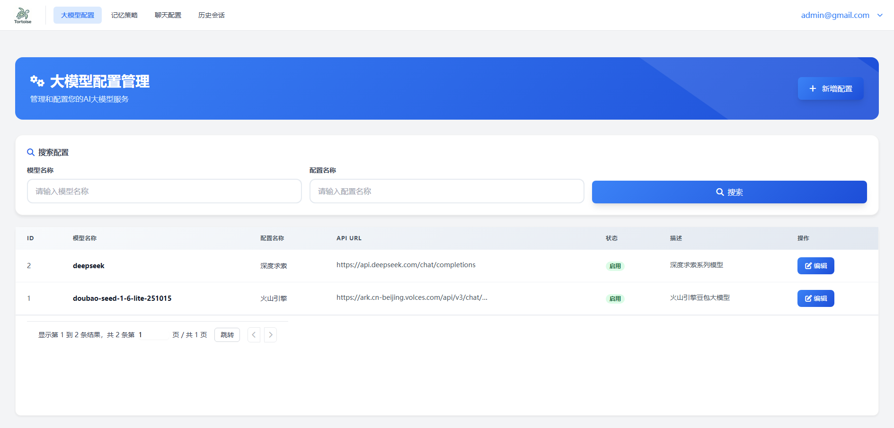

#### 初始化配置

在项目初始化时，`init-dml.sql` 文件会预置示例模型配置。您需要将其修改为实际的模型配置。

**操作方式：**
- 点击"编辑"按钮修改现有配置
- 点击"新增"按钮创建新配置

#### 新增/编辑配置界面

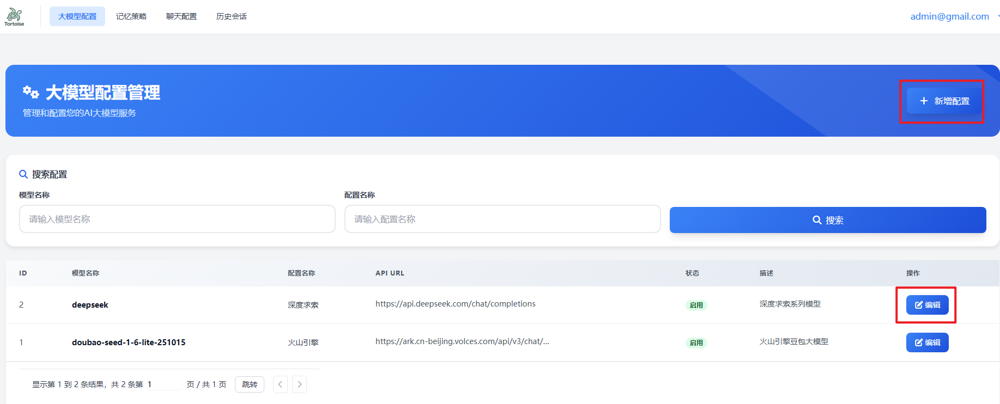
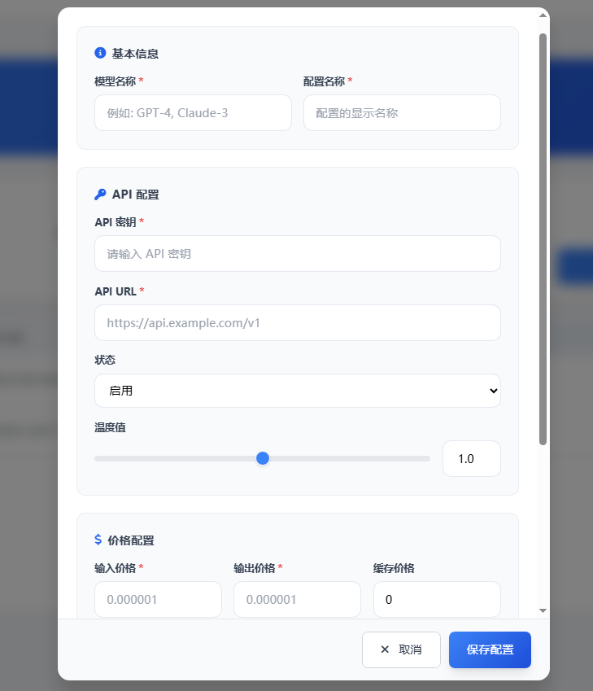

#### 配置参数详解

#### 基本信息
- **模型名称**  
  调用第三方API时传入的 `model` 参数（例如：`qwen-flash`）

- **配置名称**  
  自定义标识名称，建议与模型名称区分，避免混淆

#### API 连接配置
- **API 密钥**  
  第三方LLM服务商提供的密钥（仅需填入"Bearer "后面的部分）

- **API URL**  
  ⚠️ **请填入完整的API端点路径**  
  **说明**：由于OpenAI SDK设计了 `baseUrl + /v1/chat/completions` 的拼接方式，而部分厂商的API不支持此模式。为确保兼容性，此处需填写完整的请求地址。

#### 模型参数
- **状态**  
  `启用` / `禁用` - 仅启用的模型可在其他功能页面中被搜索和使用

- **温度值**  
  对应大模型API的 `temperature` 参数，控制生成文本的随机性

#### 成本管理
- **输入价格**  
  每 token 的成本单价（支持最多6位小数）

- **输出价格**  
  每 token 的成本单价（支持最多6位小数）

- **缓存价格**  
  部分模型在调用时可能命中缓存，若厂商未提供此信息，请设置为 `0`

**价格单位说明**：  
不同厂商可能提供"每百万token"或"每千token"的计价方式，此处已统一为"每token"计算。如需调整精度，请修改 `tortoise_llm_config` 表中的字段类型。

#### 其他信息
- **配置描述**  
  自定义说明信息，可用于记录配置的用途（例如："A组 - XX项目专用配置"）

### 4.2 记忆策略

在讲解具体配置前，需要明确一个核心的通识性问题：

#### 记忆的本质是什么？

通常，我们通过 API 与大模型对话时，服务提供方本身**不提供**记忆功能。所谓的“记忆”，完全由调用方在每次请求时提供的 `messages` 上下文数组决定。

**让我们通过一个例子来理解这个流程：**

1.  **第一次发起对话**
    ```json
    {
      "messages": [
        {
          "content": “你好，我叫王大力“,
          “role“: “user“
        }
      ]
    }
    ```

2.  **大模型回复**
    ```json
    {
      “content“: “你好呀王大力！很高兴认识你～有什么我可以帮到你的吗？“,
      “role“: “assistant“
    }
    ```

3.  **第二次发起对话（常见错误方式）**
    如果仅发送新问题，模型将失去之前的上下文。
    ```json
    {
      “messages“: [
        {
          “content“: “我叫什么名字，直接告诉我“,
          “role“: “user“
        }
      ]
    }
    ```
    **此时，大模型并不知道你的名字。**

4.  **正确的记忆方式**
    必须将完整的历史对话包含在 `messages` 中。
    ```json
    {
      “messages“: [
        {
          “content“: “你好，我叫王大力“,
          “role“: “user“
        },
        {
          “content“: “你好呀王大力！很高兴认识你～有什么我可以帮到你的吗？“,
          “role“: “assistant“
        },
        {
          “content“: “我叫什么名字，直接告诉我“,
          “role“: “user“
        }
      ]
    }
    ```
    这就是**记忆的本质**：由调用方维护并提供的对话上下文。

#### 为什么需要记忆策略？

随着对话轮数增加，`messages` 会不断增长，导致消耗的 Token 数量激增，产生高昂费用。因此，我们需要对上下文进行优化和缩短。

#### 业内通用的记忆优化策略

当前主流的解决方案有以下几种：

| 策略 | 核心思想 | 特点 |
| :--- | :--- | :--- |
| **截断** | 仅保留最近 N 轮对话。 | 简单直接，但可能丢失重要早期信息。 |
| **摘要** | 对话后，用大模型将历史总结成一段文字，下次对话时传入摘要和新问题。 | 平衡成本与信息保留，需要额外模型调用。 |
| **相关性过滤** | 维护一个“对话池”，根据相关性评分动态替换池中最不相关的对话。 | 智能化保留，实现相对复杂。 |
| **分期记忆** | 将记忆分层处理：久远记忆→关键词，中期记忆→摘要，近期记忆→完整上下文。 | 结构精细，能较好兼顾远近信息。 |
| **检索** | 根据当前输入，从所有历史对话中检索出相关的片段传入上下文。 | 类似“联网搜索”，精准但依赖检索质量。 |
| **图谱** | 将对话内容提炼成“实体-关系”图谱（如：`[我] -[是]-> [程序员]`），动态更新图谱作为记忆。 | 结构化程度高，能理解复杂关系。 |

#### 本系统提供的记忆策略

考虑到易用性和通用性，我们提供了以下三种策略，分为两大类型：

-   **无需大模型协助**
 **截断**：配置简单，资源消耗低。


-   **需要大模型协助**（需确保对应模型可用） **1.摘要**：在对话后自动生成历史摘要。 **2.图谱**：构建并维护知识图谱作为记忆。

#### 配置操作指引

现在回到配置页面：
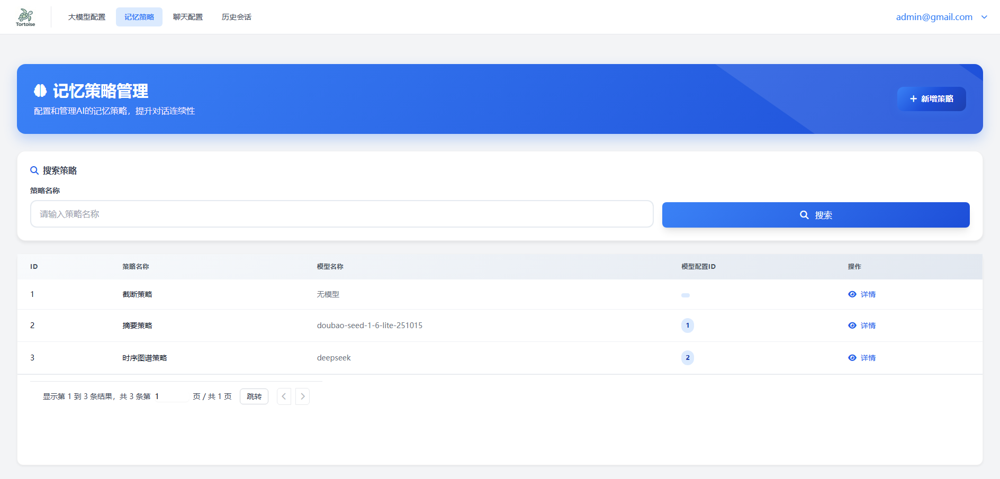

**重要提示**：
在 `init-dml.sql` 脚本中，系统会初始化记忆配置。如果您选择的策略类型是**摘要**或**图谱**，请务必在配置页面上将其关联的模型修改为 **4.1 章节中已配置并启用的模型**。

#### 4.2.1 截断
考虑到对话的完整性为一问一答，因此我们在实现截断时，基本维度就是一问一答，包括我们的表设计tortoise_message,其也包含了input和output字段
截断类型的配置非常简单，如下所示
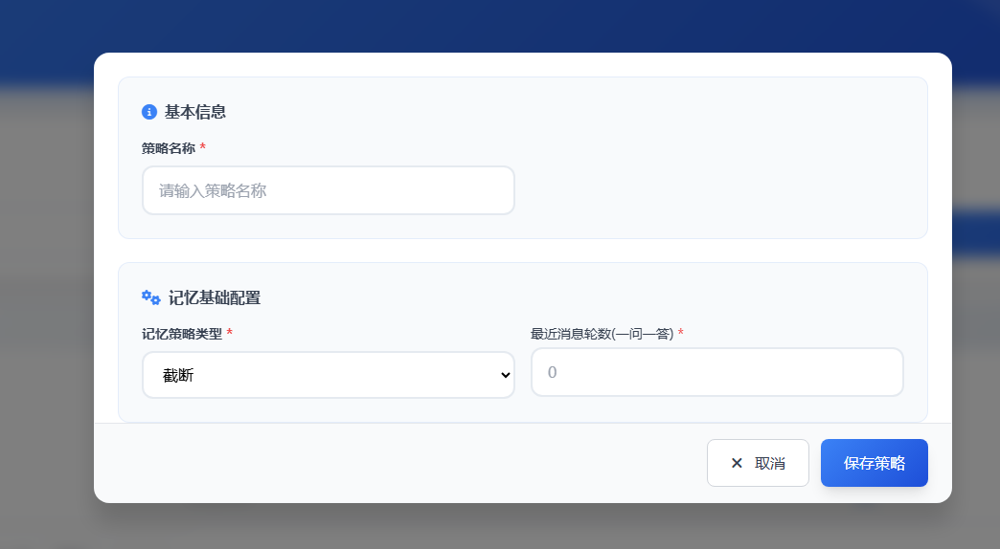

### 4.2.2 摘要与图谱记忆策略

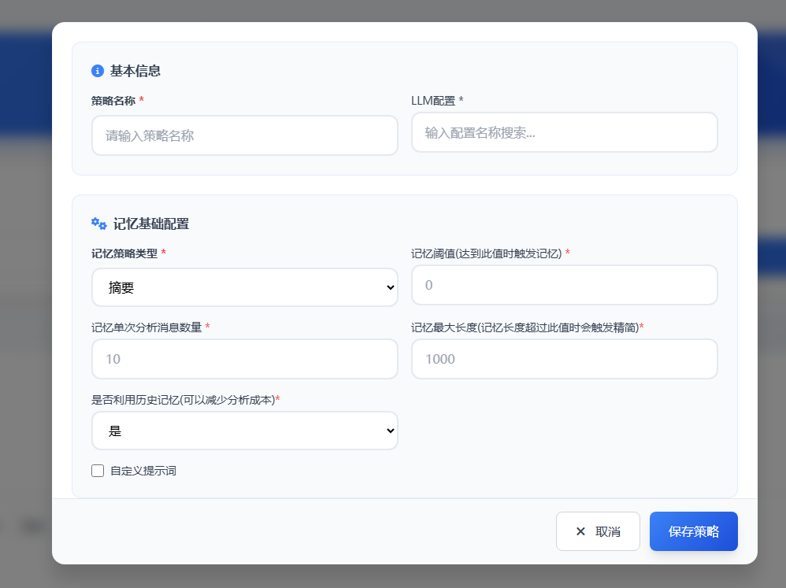

> 以上两种记忆策略的实现逻辑较为相似，因此合并说明。

#### 📌 记忆阈值
- **是什么**：触发自动记忆总结的对话轮数开关。例如设置为`20`，则每累计完成**20轮对话**，系统便会自动对这20轮内容进行一次记忆提炼。
- **为什么**：控制记忆生成的**节奏与颗粒度**。阈值越小，记忆越频繁（成本越高）；阈值越大，记忆越稀疏（可能遗漏细节）。

#### 🔢 单次分析消息数量
- **是什么**：每次调用模型进行分析时，输入给模型的**数据块大小**，主要受模型上下文长度限制。
- **示例**：记忆阈值=`100`，单次分析量=`20` → 系统会将100轮对话切分为5个20轮的块，分批分析后汇总结果。
- **为什么**：解决**长上下文无法一次性处理**的问题，实现大对话量的分块分析。

#### 📏 记忆最大长度
- **是什么**：对生成的记忆内容（摘要/图谱）设定的**长度限制器**。当记忆内容超过该字数限制时，系统会自动触发压缩，保留核心、舍弃次要信息。
- **为什么**：防止记忆**无限膨胀**，影响后续使用的检索效率、准确性和成本。

#### 🔄 “是否利用历史记忆” 的逻辑差异
假设 **记忆阈值 = 20**，当前已对话 **39 轮**，且第1-20轮的对话已生成**历史记忆A**。
当**第40轮对话完成**时（`40 % 20 = 0`），会触发新一轮记忆生成。

| 选项 | 工作模式 | 核心流程 | 优点与场景 |
| :--- | :--- | :--- | :--- |
| **启用（是）**<br>**_增量更新_** | 在已有记忆基础上更新。 | 1. 用**基础提示词**分析第21-40轮，生成**新记忆B**。<br>2. 用**更新提示词**，将**历史记忆A**与**新记忆B**合并，生成**最终记忆C**。<br>3. 存入**记忆C**。 | **优点**：效率高、成本低（仅分析新增对话）。<br>**场景**：常规生产环境。提示词稳定，需持续累积记忆。 |
| **不启用（否）**<br>**_全量重算_** | 忽略已有记忆，重新计算全部。 | 1. 用**基础提示词****重新分析**第1-20轮，生成**新记忆B‘**（重新计算）。<br>2. 用**基础提示词**分析第21-40轮，生成**新记忆C‘**。<br>3. 用**更新提示词**，将**B‘** 和 **C‘** 合并，生成**最终记忆D**。<br>4. 存入**记忆D**。 | **缺点**：成本高（重复分析旧数据）、效率低。<br>**场景**：**提示词迭代调试期**。修改提示词后，需要所有历史数据按新规则重新生成，保证全局一致性。 |

#### ✍️ 自定义提示词
前述记忆功能涉及多个需要提示词的环节，因此系统支持**自定义提示词**。如不填写，则默认采用系统预置配置。

我们将提示词分为三类：
1.  **基础提示词**：用于从原始对话块中首次提取记忆。
2.  **更新提示词**：用于将新旧两份记忆合并成一份更新的记忆。
3.  **超长提示词**：用于当记忆内容超过“记忆最大长度”时，对其进行压缩和精简。

**🎯 综合示例**
- **限制条件**：记忆阈值=`20`，单次分析量=`20`，启用历史记忆，最大长度=`500`
- **当前状态**：刚完成第100次对话，已有**记忆A (1-80)**
- **执行流程**：
 1.  使用**基础提示词**，分析第81-100轮对话，提取得到**记忆B (81-100)**。
 2.  使用**更新提示词**，将**记忆A (1-80)** 和 **记忆B (81-100)** 合并，得到**记忆C (1-100)**。
 3.  检查发现**记忆C**长度超过500字，触发压缩。
 4.  使用**超长提示词**，对**记忆C**进行精简，得到**记忆D (1-100)**。
 5.  最终，将**记忆D**存入数据库。

> **提示**：各项参数（阈值、分析量、长度等）的最佳配置值，需根据具体的应用场景、成本预算和对记忆精细度的要求来决定。


## 4.3 聊天配置

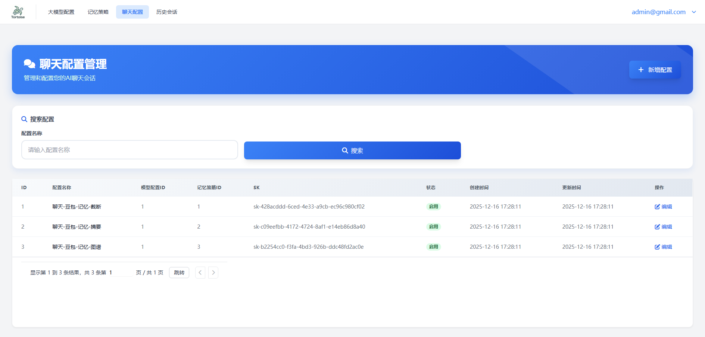

聊天配置页面的核心功能是**生成和管理访问密钥（SK）**。其核心操作在创建配置的弹窗中完成。

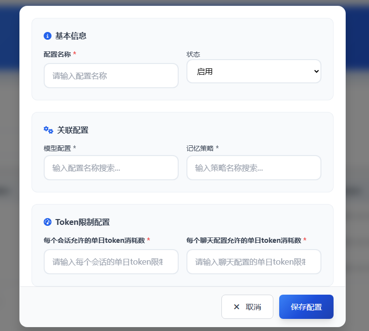

### 🔧 创建聊天配置
创建新的聊天配置（即生成一个SK），需填写以下关键信息：
1.  **选择模型**：从已配置的模型（参见 [4.1 模型配置](#41-模型配置)）中选择一个。
2.  **选择记忆策略**：从已配置的记忆策略（参见 [4.2 记忆策略](#42-记忆策略)）中选择一种。
3.  **输入Token上限**：设置**此SK下所有会话合计**允许的**单日Token消耗上限**。
4.  **点击保存**：完成创建。

### 🔑 获取与使用SK
- **获取SK**：配置创建成功后，页面将**展示生成的SK值**。
- **使用SK**：如在 [1.2 通过管理台创建会话](#12-通过管理台创建会话) 中所述，在管理台创建新会话时，需要传入的正是此SK值。

### 💡 配置关系说明
- **一个SK对应多个会话**：每个聊天配置（SK）下可以创建和管理多个独立的聊天会话。
- **Token限额设计**：
 - **聊天配置的Token上限**：指该SK下**所有会话累计**的每日消耗限额。
 - **会话的Token上限**：指**单个会话**的每日消耗限额（在记忆策略中配置）。
 - **关系建议**：为确保业务正常运行，`聊天配置的Token上限` 应 **大于** `会话Token上限 × 预估的平均会话数`。具体数值需根据实际业务场景和并发量进行规划。


## 4.4 历史会话管理

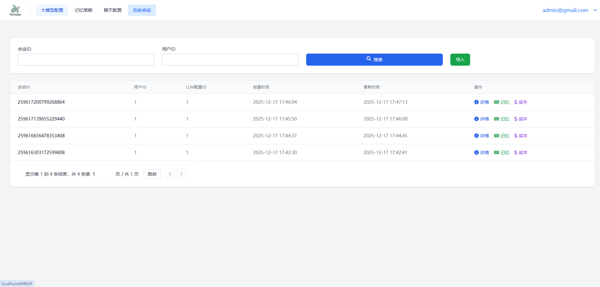

当通过客户端调用`chat`接口后，系统会触发`afterChat`方法。此方法将结合 **[4.1 模型配置](#41-模型配置)** 和 **[4.2 记忆策略](#42-记忆策略)** 中的设定，自动记录本次会话的**消息内容**、**成本消耗**与**记忆摘要**。

### 📜 消息内容页面
此页面按时间顺序完整展示会话中的所有对话记录。

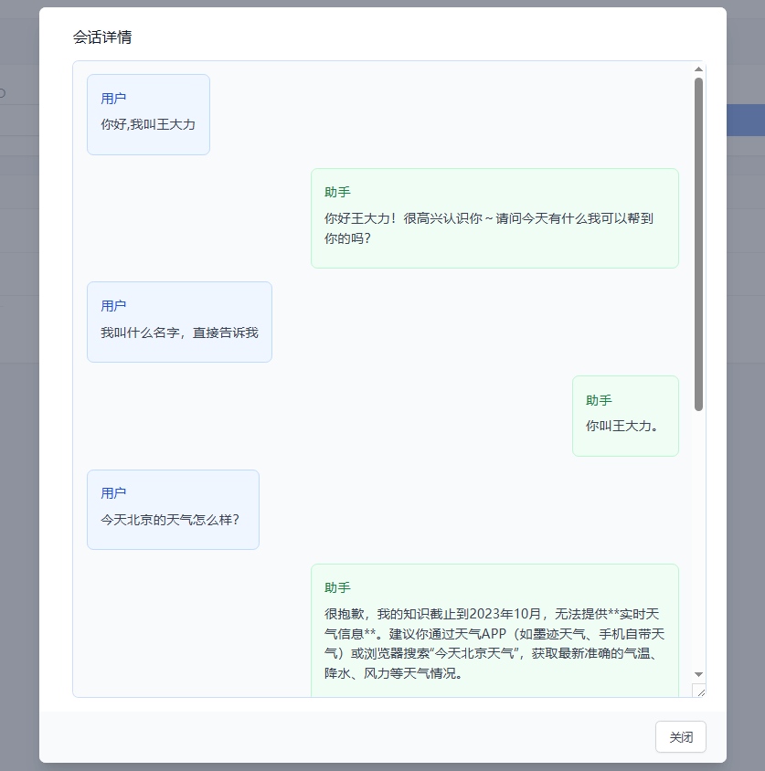

### 🧠 记忆页面
> 此页面展示的消息内容，取决于具体的记忆策略，和记忆进度，比如，如下为截断类型的记忆

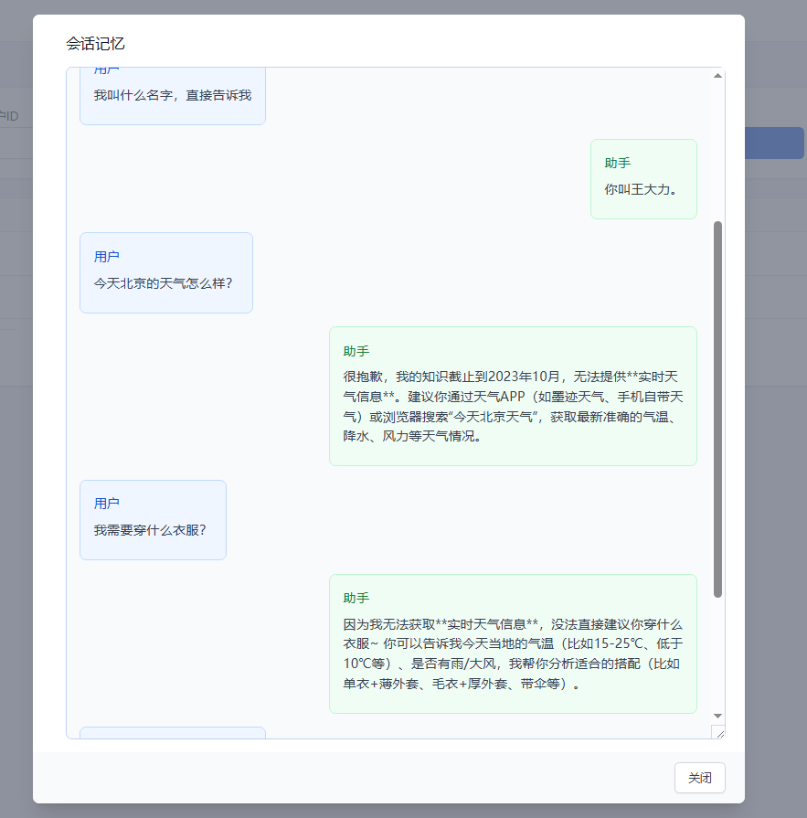

### 💰 成本页面
此页面详细列出该会话产生的所有Token消耗及对应的成本计算。

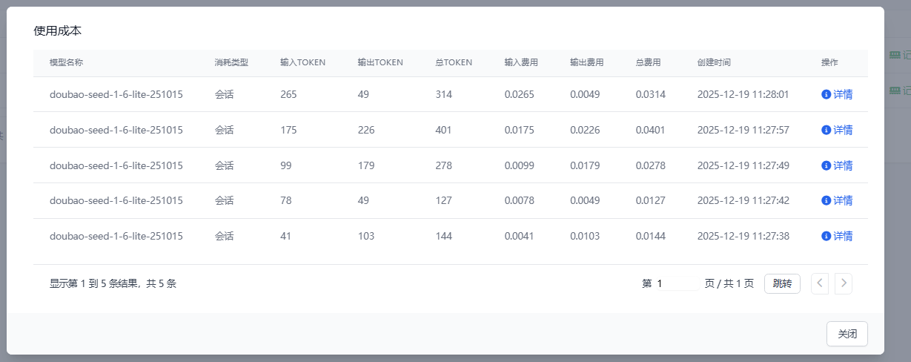

- **查看明细**：点击 **`详情`** 按钮，查看某次具体调用时的输入(Input)与输出(Output)详情

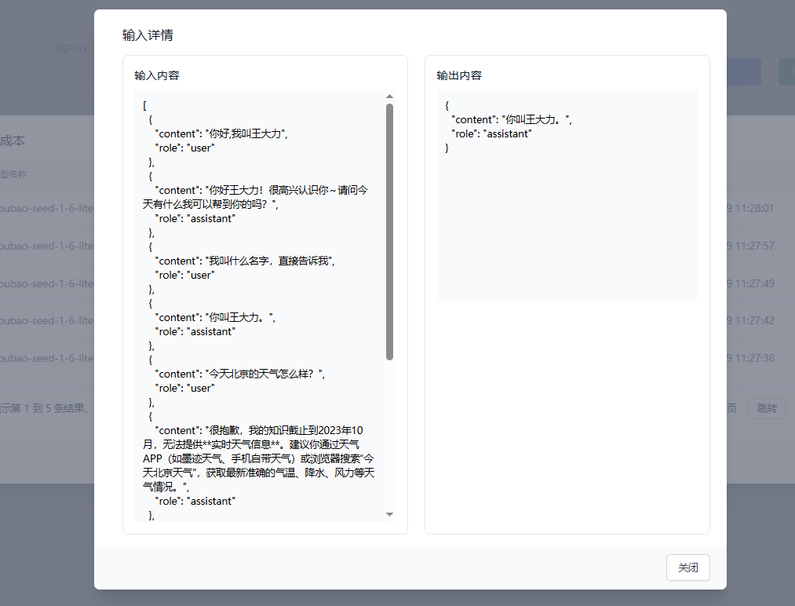


## 5记忆策略Demo

### 5.1截断Demo
```java
package io.github.johntortoise.demo.controller;

import io.github.johntortoise.core.client.TortoiseClient;
import io.github.johntortoise.core.dto.model.ChatCompletionResponse;
import io.github.johntortoise.core.dto.sys.TortoiseMessage;

public class Test {

    public static String host = "http://localhost:8080";

    /**
     *  此sk，请配置记忆策略为截断策略，最新消息数为2
     */
    public static String sk = "sk-428acddd-6ced-4e33-a9cb-ec96c980cf02";

    private final static TortoiseClient<ChatCompletionResponse> tortoiseClient = TortoiseClient.createForAdmin(ChatCompletionResponse.class,host,sk);

    public static void main(String[] args) throws InterruptedException {
        String conversationId = tortoiseClient.createConversation("zgsssjznbdgj");

        //第一条
        TortoiseMessage firstMessage = new TortoiseMessage("你好,我叫王大力");
        firstMessage.setConversationId(conversationId);
        tortoiseClient.chatForAdmin(firstMessage);

        Thread.sleep(2000L);

        //第二条
        TortoiseMessage secondMessage = new TortoiseMessage("我叫什么名字，直接告诉我");
        secondMessage.setConversationId(conversationId);
        tortoiseClient.chatForAdmin(secondMessage);

        Thread.sleep(2000L);

        //第三条(上下文是1-2)
        TortoiseMessage thirdMessage = new TortoiseMessage("今天北京的天气怎么样？");
        thirdMessage.setConversationId(conversationId);
        tortoiseClient.chatForAdmin(thirdMessage);

        Thread.sleep(2000L);

        //第四条(上下文是2-3)
        TortoiseMessage fourthMessage = new TortoiseMessage("我需要穿什么衣服？");
        fourthMessage.setConversationId(conversationId);
        tortoiseClient.chatForAdmin(fourthMessage);

        Thread.sleep(2000L);

        //第五条(上下文是3-4，这里应该回答不出来了)
        TortoiseMessage fifthMessage = new TortoiseMessage("我叫什么名字，直接告诉我");
        fifthMessage.setConversationId(conversationId);
        tortoiseClient.chatForAdmin(fifthMessage);

    }
}
```

看一下demo运行后的对话内容

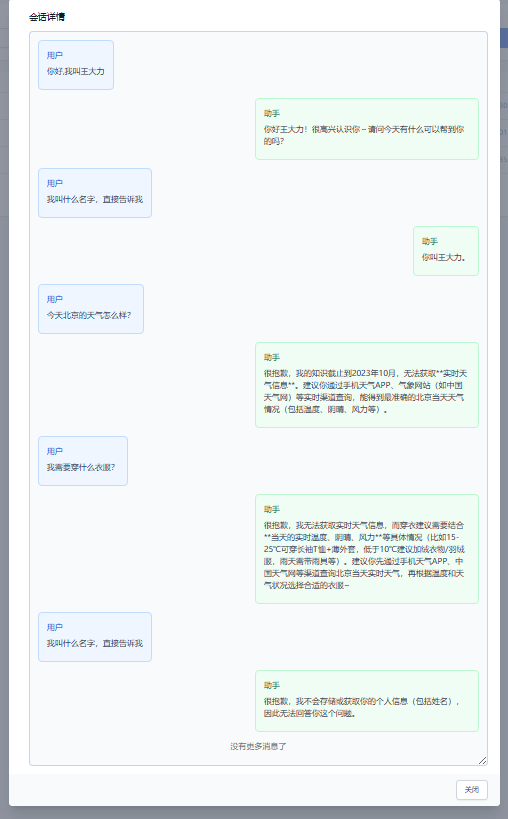

由于配置的最近消息数是两轮，所以当第五次询问大模型时，其已经丢失了名字信息
再看一下记忆

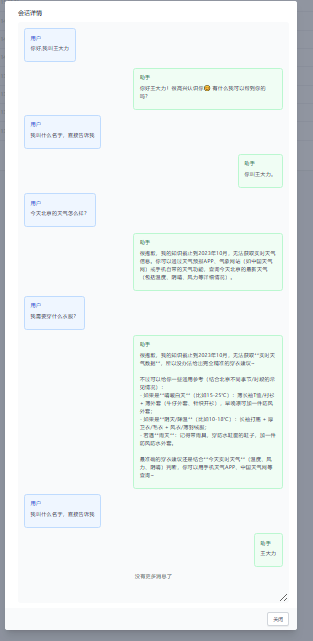也只有最后两轮


### 5.2摘要Demo
```java
package io.github.johntortoise.demo.controller;

import io.github.johntortoise.core.client.TortoiseClient;
import io.github.johntortoise.core.dto.model.ChatCompletionResponse;
import io.github.johntortoise.core.dto.sys.TortoiseMessage;

public class Test {

 public static String host = "http://localhost:8080";

 /**
  *  此sk，请配置记忆策略为摘要策略，阈值为2，单次分析2，启用历史记忆，最大记忆长度为100
  */
 public static String sk = "sk-c09eefbb-4172-4724-8af1-e14eb86d8a40";

 private final static TortoiseClient<ChatCompletionResponse> tortoiseClient = TortoiseClient.createForAdmin(ChatCompletionResponse.class,host,sk);

 public static void main(String[] args) throws InterruptedException {
  String conversationId = tortoiseClient.createConversation("zgsssjznbdgj");

  //第一条
  TortoiseMessage firstMessage = new TortoiseMessage("你好,我叫王大力");
  firstMessage.setConversationId(conversationId);
  tortoiseClient.chatForAdmin(firstMessage);

  Thread.sleep(2000L);

  //第二条
  TortoiseMessage secondMessage = new TortoiseMessage("我叫什么名字，直接告诉我");
  secondMessage.setConversationId(conversationId);
  tortoiseClient.chatForAdmin(secondMessage);

  //这里睡眠10秒等一下记忆
  Thread.sleep(10000L);

  //第三条(上下文：记忆A(1-2))
  TortoiseMessage thirdMessage = new TortoiseMessage("今天北京的天气怎么样？");
  thirdMessage.setConversationId(conversationId);
  tortoiseClient.chatForAdmin(thirdMessage);

  Thread.sleep(2000L);

  //第四条(上下文：记忆A(1-2) 和3的输入输出)
  TortoiseMessage fourthMessage = new TortoiseMessage("我需要穿什么衣服？");
  fourthMessage.setConversationId(conversationId);
  tortoiseClient.chatForAdmin(fourthMessage);

  //这里睡眠10秒等一下记忆
  Thread.sleep(10000L);

  //第五条(上下文 ：记忆B(1-4) 或 上下文呢记忆A(1-2)和3，4的输入输出 取决于记忆有没有生成，如果没生成，拿的是记忆和记忆之外的所有消息))
  TortoiseMessage fifthMessage = new TortoiseMessage("我叫什么名字，直接告诉我");
  fifthMessage.setConversationId(conversationId);
  tortoiseClient.chatForAdmin(fifthMessage);

 }
}
```
看一下对话过程


从对话可以看到，最后一问的时候回答出了我们的名字，与截断不同
再看当前的记忆

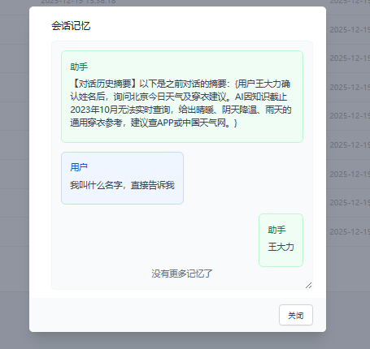

可以看到一段总结，还有第五轮对话，因为第五轮对话还未生成记忆

使用成本
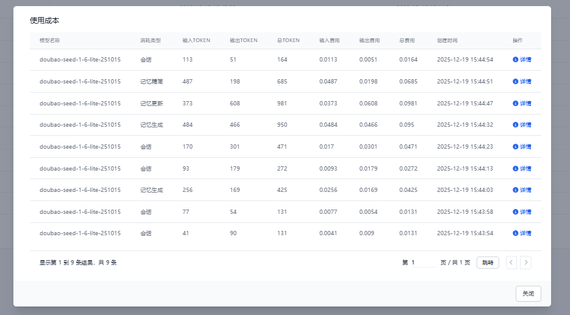

可以看到是 会话→会话→记忆生成(达到阈值触发)→会话→会话→记忆生成(达到阈值触发)→记忆更新(这里是将1-2的记忆和3-4的记忆更新)→记忆精简(由于最终更新的记忆还是超过了长度，所以触发了精简)→会话

### 5.3图谱Demo
```java
package io.github.johntortoise.demo.controller;

import io.github.johntortoise.core.client.TortoiseClient;
import io.github.johntortoise.core.dto.model.ChatCompletionResponse;
import io.github.johntortoise.core.dto.sys.TortoiseMessage;

public class Test {

    public static String host = "http://localhost:8080";

    /**
     *  此sk，请配置记忆策略为摘要策略，阈值为2，单次分析2，启用历史记忆
     */
    public static String sk = "sk-b2254cc0-f3fa-4bd3-926b-ddc48fd2ac0e";

    private final static TortoiseClient<ChatCompletionResponse> tortoiseClient = TortoiseClient.createForAdmin(ChatCompletionResponse.class,host,sk);

    public static void main(String[] args) throws InterruptedException {
        String conversationId = tortoiseClient.createConversation("zgsssjznbdgj");

        //第一条
        TortoiseMessage firstMessage = new TortoiseMessage("你好,我叫王大力");
        firstMessage.setConversationId(conversationId);
        tortoiseClient.chatForAdmin(firstMessage);

        Thread.sleep(2000L);

        //第二条
        TortoiseMessage secondMessage = new TortoiseMessage("我叫什么名字，直接告诉我");
        secondMessage.setConversationId(conversationId);
        tortoiseClient.chatForAdmin(secondMessage);

        //这里睡眠10秒等一下记忆
        Thread.sleep(10000L);

        //第三条(上下文：记忆A(1-2))
        TortoiseMessage thirdMessage = new TortoiseMessage("今天北京的天气怎么样？");
        thirdMessage.setConversationId(conversationId);
        tortoiseClient.chatForAdmin(thirdMessage);

        Thread.sleep(2000L);

        //第四条(上下文：记忆A(1-2) 和3的输入输出)
        TortoiseMessage fourthMessage = new TortoiseMessage("我需要穿什么衣服？");
        fourthMessage.setConversationId(conversationId);
        tortoiseClient.chatForAdmin(fourthMessage);

        //这里睡眠30秒等一下记忆
        Thread.sleep(30000L);

        //第五条(上下文 ：记忆B(1-4) 或 上下文呢记忆A(1-2)和3，4的输入输出 取决于记忆有没有生成，如果没生成，拿的是记忆和记忆之外的所有消息))
        TortoiseMessage fifthMessage = new TortoiseMessage("我叫什么名字，直接告诉我");
        fifthMessage.setConversationId(conversationId);
        tortoiseClient.chatForAdmin(fifthMessage);

    }
}
```

看一下记忆
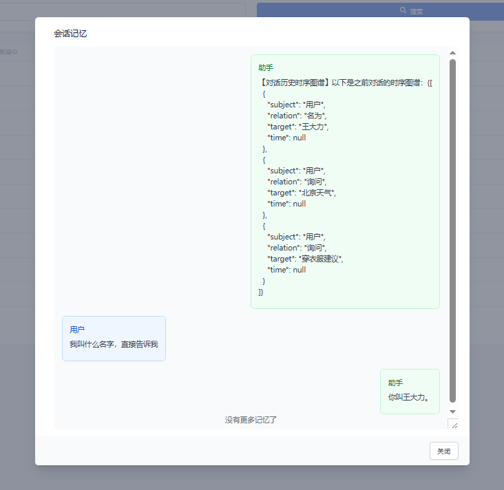

## 6. 仅接入记忆功能

> **前置要求**：请先按照 **4.3 章节** 完成相关配置。

### 6.1 导入历史数据

我们提供了数据导入接口，您可以通过以下步骤导入历史对话数据。

#### 操作步骤
1. **点击导入按钮**
   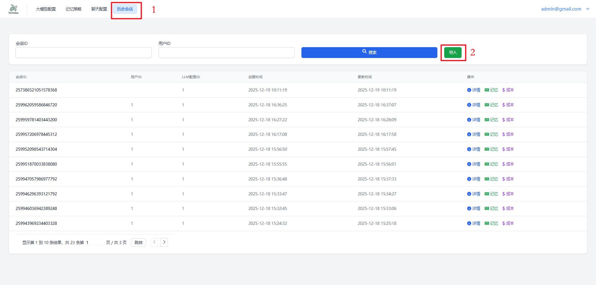

2. **进入导入页面**
   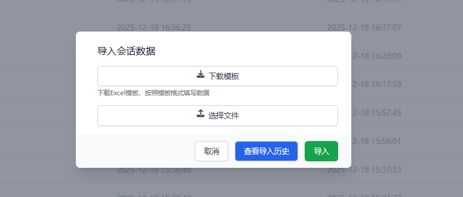

3. **下载并填写模板**
    - 点击 **“下载模板”** 获取标准格式文件。

#### 模板字段说明
| 字段名 | 说明 |
| :--- | :--- |
| `conversation_id` | 会话标识。一个会话（Conversation）可包含多条对话记录。 |
| `chat_profile_id` | 根据 4.3 配置后生成的配置ID。**注意：这不是SK**。 |
| `unique_id` | 代表一次“一问一答”的唯一标识符。 |

#### 数据填写示例
填写后的模板文件示例如下：
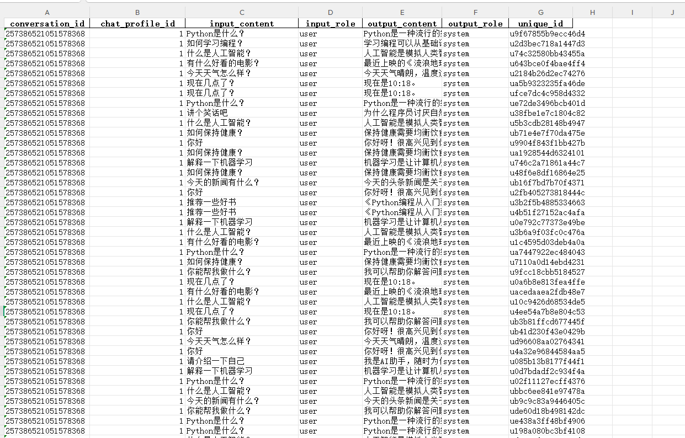

#### 执行导入
1. 点击 **“选择文件”**，上传填写好的数据文件。
2. 我们以 **50万行** 的数据文件为例（路径：`docs/img/file/conversation_import_data_500k.xlsx`）。

#### 导入状态
- **处理中状态**
  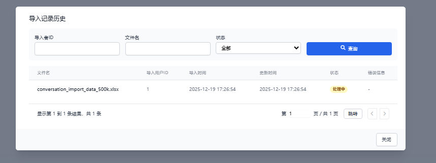
  > 本次示例导入50万行数据，耗时约 **87秒**。

- **导入成功状态**
  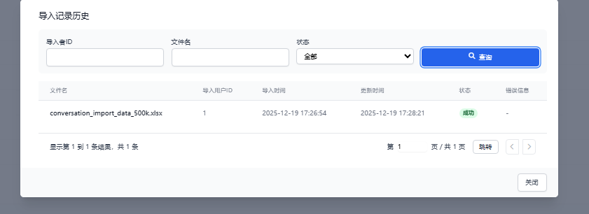

### 6.2 触发记忆生成

当推送消息时，如果 **未生成记忆的消息数量达到或超过您设定的阈值**，系统将自动触发记忆生成。

#### 调用示例代码
```java
package io.github.johntortoise.demo.controller;

import io.github.johntortoise.core.client.TortoiseClient;
import io.github.johntortoise.core.dto.model.ChatCompletionResponse;
import io.github.johntortoise.core.dto.model.Message;
import io.github.johntortoise.core.dto.sys.ReceiveMessageReq;
import io.github.johntortoise.core.enums.RoleEnum;

public class Test {

    public static String host = "http://localhost:8080";

    /**
     * 此 SK，请填写对应 chat_profile_id 所配置的 SK
     */
    public static String sk = "sk-428acddd-6ced-4e33-a9cb-ec96c980cf02";

    private final static TortoiseClient<ChatCompletionResponse> tortoiseClient = TortoiseClient.createForAdmin(ChatCompletionResponse.class, host, sk);

    public static void main(String[] args) {
        ReceiveMessageReq build = ReceiveMessageReq.builder().conversationId("257386521051582337").build();
        build.setInput(new Message("你好，我叫王大力", RoleEnum.SYSTEM.getCode()));
        build.setOutPut(new Message("王大力你好", RoleEnum.SYSTEM.getCode()));
        tortoiseClient.sendMessage(build);
    }
}
```

#### ⚠️ 重要提示
如果您的历史记忆数据量很大，请务必**在导入前调整 `chat_profile_id` 对应的记忆上限配置**，否则可能会触发系统报错。
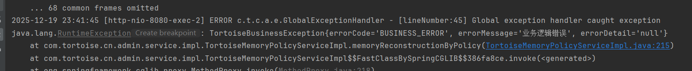

### 6.3 获取记忆内容

您可能会担心以下情况：
- 一次性导入了大批量的历史对话
- 导入时记忆尚未完成生成

针对上述情况，我们设计了**兜底策略**：
如果记忆尚未生成，系统将返回您所配置的**最近 X 轮对话**作为记忆内容，其中 **X 即为您配置的记忆阈值**。

#### 调用示例
```java
package io.github.johntortoise.demo.controller;

import io.github.johntortoise.core.client.TortoiseClient;
import io.github.johntortoise.core.dto.model.ChatCompletionResponse;
import io.github.johntortoise.core.dto.model.Message;
import io.github.johntortoise.core.dto.sys.ReceiveMessageReq;
import io.github.johntortoise.core.dto.sys.TortoiseMessage;
import io.github.johntortoise.core.enums.RoleEnum;

import java.util.List;

public class Test {

    public static String host = "http://localhost:8080";

    /**
     * 此 SK 请填写对应 chat_profile_id 所配置的 SK
     */
    public static String sk = "sk-428acddd-6ced-4e33-a9cb-ec96c980cf02";

    private final static TortoiseClient<ChatCompletionResponse> tortoiseClient = TortoiseClient.createForAdmin(ChatCompletionResponse.class, host, sk);

    public static void main(String[] args) {
        List<Message> memory = tortoiseClient.getMemory("257386521051582337");
        System.out.println(memory);
    }
}
```

## 7 未来
 我们将不断优化我们的系统，为开源贡献自己的力量


